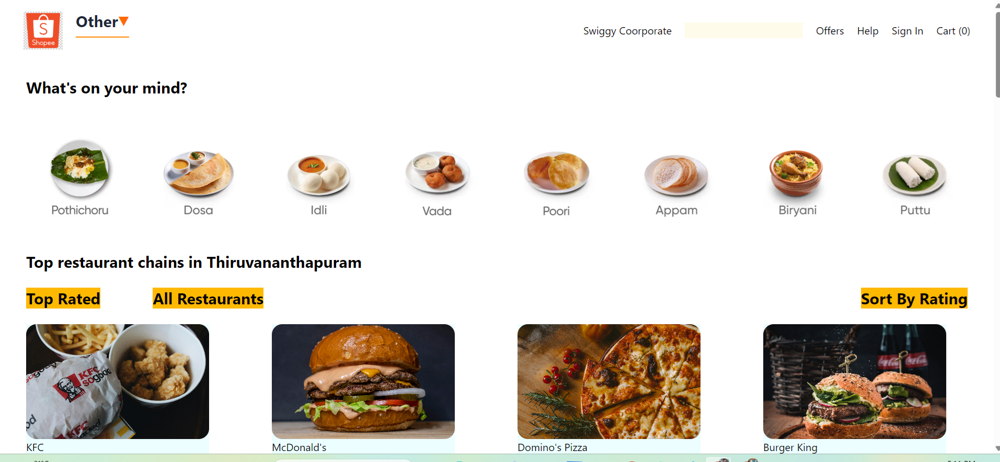
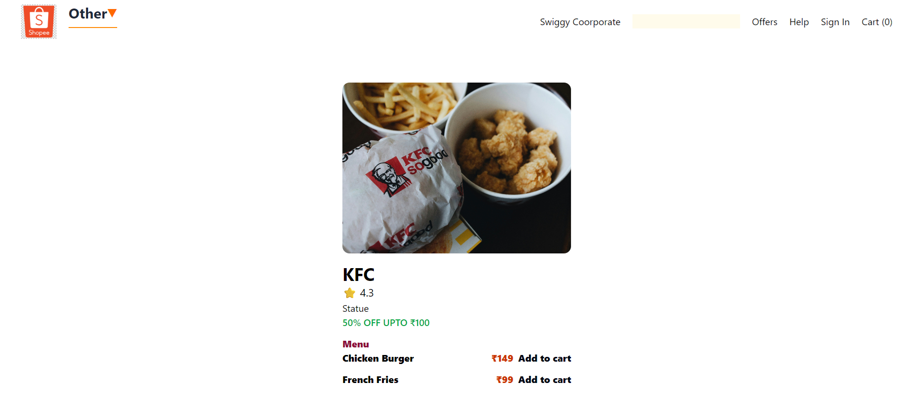
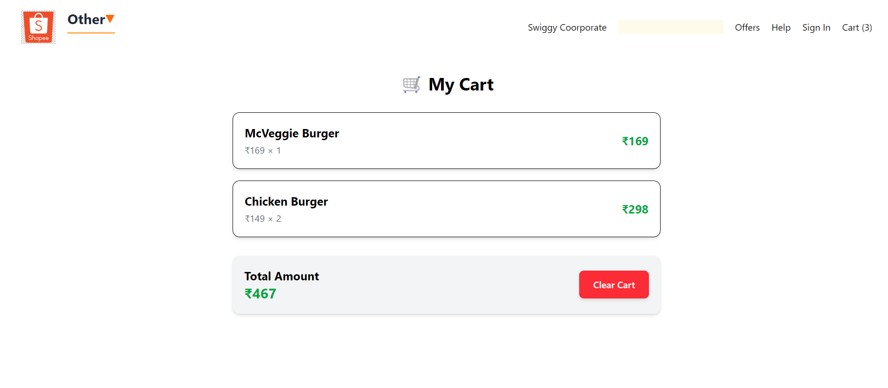

# 🍔 Food App (Swiggy Clone)

A modern food ordering application built with **React.js** that demonstrates core React concepts such as component-based architecture, routing, Context API, lazy loading, code splitting, API integration, and cart management.

---

## 🚀 Live Demo

🔗 **https://food-app-three-navy.vercel.app/**

---

# 📸 Screenshots

## 🏠 Home Page



---

## 🍽️ Restaurant Details



---

## 🛒 Cart



---

# ✨ Features

- 🍽 Restaurant Listing
- 🔍 Search Restaurants
- ⭐ Filter Top Rated Restaurants
- 📊 Sort Restaurants by Rating
- 📄 Dynamic Restaurant Details Page
- 🛒 Add Items to Cart
- ➖ Remove Items from Cart
- 🗑 Clear Cart
- 📦 Quantity Management
- ⚡ Lazy Loading
- ✂️ Code Splitting
- 🔄 Dynamic Routing
- 🌐 API Data Fetching
- 📱 Clean Desktop UI

---

# 🛠 Tech Stack

- React.js
- JavaScript (ES6+)
- React Router DOM
- Context API
- Tailwind CSS
- Vite

---

# 📚 React Concepts Used

- Functional Components
- JSX
- Props
- State Management (`useState`)
- Side Effects (`useEffect`)
- Context API (`useContext`)
- Component Memoization (`React.memo`)
- Lazy Loading (`React.lazy`)
- Suspense
- Code Splitting
- Conditional Rendering
- Event Handling
- Dynamic Routing
- List Rendering
- Array Methods (`map`, `filter`, `reduce`, `sort`)

---

# 📂 Project Structure

```
swiggy-clone
│
├── assets
│   └── screenshots
│
├── public
│
├── src
│   ├── components
│   ├── context
│   ├── data
│   ├── assets
│   ├── App.jsx
│   └── main.jsx
│
├── README.md
├── package.json
└── vite.config.js
```

---

# ⚙️ Installation

Clone the repository

```bash
git clone https://github.com/arun-devs/food-app.git
```

Go to the project directory

```bash
cd food-app
```

Install dependencies

```bash
npm install
```

Start the development server

```bash
npm run dev
```

Build for production

```bash
npm run build
```

---

# 🌍 Deployment

This project is deployed using **Vercel**.

Live URL:

https://food-app-three-navy.vercel.app/

---

# 📖 Future Improvements

- Responsive Mobile UI
- User Authentication
- Checkout Page
- Order History
- Payment Integration
- Wishlist
- Dark Mode
- Backend Integration
- Redux Toolkit

---

# 👨‍💻 Author

**Arun Dev**

GitHub: https://github.com/arun-devs

---

## ⭐ If you like this project

Please consider giving it a ⭐ on GitHub!